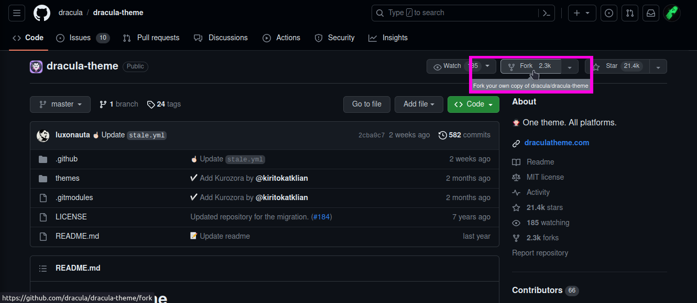
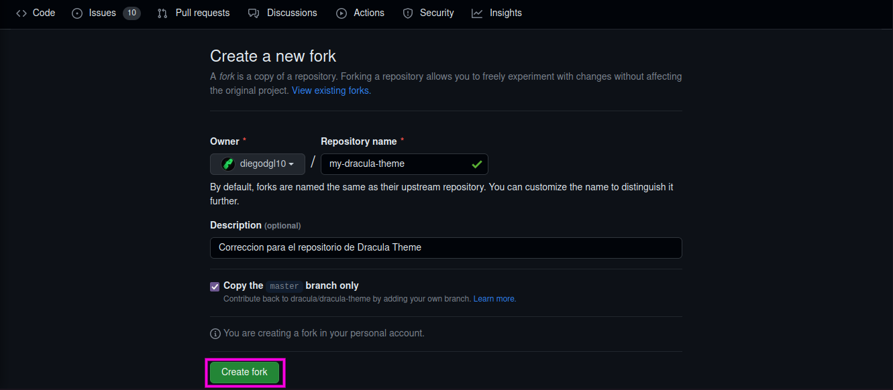
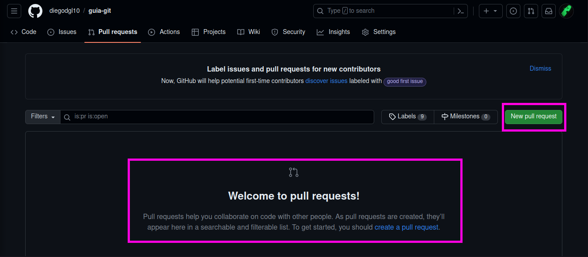

# Comandos básicos de trabajo

--------------------------------------------------------------------------------

PPara este momento ya se debe de poseer Git instalado y configurado. De no ser así, puedes seguir los pasos indicados en [Instalación y Configurando Git y GitHub en Mac y Linux](Install-Config.md). Una vez se tenga todo preparado, podemos comenzar a revisar algunos de los comandos y conceptos fundamentales a la hora de trabajar con Git.

A continuación mostraremos los comandos en el orden en el que se suelen usar para trabajar en un proyecto de software.


## Iniciar un proyecto

El comando `git init` se utiliza para inicializar un nuevo repositorio en un directorio local. Al ejecutar este comando en un directorio vacío o existente, Git crea una estructura de control de versiones en ese directorio, permitiéndote realizar un seguimiento de los cambios en tu código y utilizar las funcionalidades de Git.

Para iniciar un proyecto en Git, nos colocamos en nuestra carpeta y usamos el comando `git init`

```
~/proyecto/ git init
```


## Clonar repositorios

No siempre iniciaremos proyectos desde 0, pues en ocasiones retomaremos proyectos pasados que están almacenados de forma remota, o simplemente nos uniremos a un proyecto creado por otro miembro de nuestro equipo de trabajo. Con el comando `git clone` podemos crear una copia local de un repositorio remoto completo, incluyendo todo el historial de versiones y ramas disponibles en el repositorio remoto. En resumen, `git clone` se utiliza para descargar y crear una copia local de un proyecto existente en un servidor remoto.

Una vez estemos en nuestra carpeta ejecutaremos el comando `git clone`

```
~ git clone git@github.com:diegodgl10/imageToText.git
# PD: debemos colocar el enlace SSH del repositorio que deseamos clonar
```


## Pull y Fetch

Usualmente, cuando estemos trabajando en equipo, otros miembros del equipo irán actualizando el proyecto, para depurar errores o aumentar funcionalidades, por lo que si deseamos actualizar nuestra copia local podemos de hacerlo con el comando `pull`. El comando `pull` se utiliza para obtener los últimos cambios de un repositorio remoto y fusionarlos con tu copia local. Básicamente, actualiza tu repositorio local con los cambios más recientes realizados por otros colaboradores.

```
~/proyecto/ git pull origin rama-remota
# PD: es el nombre del repositorio remoto del cual deseas obtener los cambios y "mi-rama" es el nombre de la rama remota que deseas fusionar en tu rama local. 
```

Adicionalmente, cabe resaltar que no es la única forma de hacerlo, pues podemos usar el comando `fetch` y el comando `merge` para emular el comando `pull`.


## Ramificaciones

Una rama (branch) en Git es una línea independiente de desarrollo que permite trabajar en diferentes características, correcciones de errores o experimentos sin afectar la rama principal (generalmente llamada "master" o "main"). Cada rama tiene su historial de cambios y se puede fusionar con otras ramas cuando sea necesario. Las ramas facilitan la colaboración y el desarrollo paralelo al proporcionar un entorno aislado para realizar modificaciones sin interferir con el código base.

Para ver las ramas locales que posee usamos el comando

```
~/proyecto/ git branch
* master
# PD: por defecto únicamente tendrás la rama máster
```

Para crear una nueva rama realizamos lo siguiente

```
~/proyecto/ git branch testeo # creamos una rama con el nombre testeo
```

Para mudarnos a la nueva rama lo hacemos de la siguiente forma

```
~/proyecto/ git checkout testeo
Cambiado a rama 'testeo'
~/proyecto/ git branch
  master
* testeo # verificamos que hemos cambiado a la rama testeo
```

Puedes realizar este proceso en un solo paso con el comando

```
~ git checkout -b produccion # creas una nueva rama llamada produccion y te mueves a ella
Cambiado a nueva rama 'produccion'
```

## Commits

Una vez hayas llegado a un punto en el cual deseas guardar tus avances, debes de hacerlo realizando commits, los cuales por buenas prácticas de programación deben de contar con una descripción de que cambios o avances se han realizado. De esta forma, tanto tú como otros programadores pueden entender mejor las actualizaciones del proyecto. Por lo que al usar comité estarás versionando tu proyecto y si hubiera una complicación en algún momento, podrás regresar a un commit anterior.

Primero debemos de indicar que archivos queremos agregar al commit.

```
~/proyecto/ git add files/ img/
```

Posteriormente, realizamos el commit agregando un mensaje

```
~/proyecto/ git commit -m 'agregando imagenes para el archivo files/Install-Config.md'
```


## Merge

El comando `merge` se utiliza para combinar los cambios de una rama en otra. Por ejemplo, puedes fusionar una rama de desarrollo con la rama principal una vez que una nueva característica esté completa y probada. Git fusionará automáticamente los cambios y creará un nuevo commit que combina ambas ramas. Esto permite incorporar las actualizaciones de una rama en otra y asegurarse de que los cambios estén disponibles para todos los colaboradores.

Para esto primero nos colocamos en la rama sobre la que se aplicara la fusión y posteriormente hacemos lo siguiente

```
~/proyecto/ git merge produccion # hacemos la fusion con la rama llamada produccion
```


## Push

El comando `push` se utiliza para enviar los cambios locales a un repositorio remoto. Después de realizar modificaciones en tu código local, puedes usar `push` para subir tus cambios al repositorio compartido, permitiendo que otros colaboradores vean y accedan a tus actualizaciones. El comando `push` sincroniza tu rama local con la rama correspondiente en el repositorio remoto.

```
~/proyecto/ git push -u origin master # estamos empujando los cambios a la rama remota master
```


--------------------------------------------------------------------------------

## Forks

Un "fork" es una copia independiente de un repositorio existente. Al hacer un fork de un repositorio, se crea una bifurcación o ramificación separada del proyecto original, lo que permite a los usuarios realizar cambios y modificaciones en su propia versión del proyecto sin afectar el repositorio original.

Cuando se hace un fork, se crea una copia completa del repositorio original, incluyendo todo el historial de commits, ramas y archivos. Esta copia se guarda en una nueva ubicación, generalmente en una cuenta personal del usuario o en otro repositorio remoto. A partir de ese momento, el usuario puede trabajar en su versión independiente del proyecto, realizar cambios, agregar nuevas funcionalidades, solucionar problemas o realizar cualquier modificación que desee.

Permiten a los usuarios colaborar y contribuir a proyectos de código abierto de forma segura y sin afectar directamente el repositorio original. Los cambios realizados en el fork se pueden enviar de vuelta al repositorio original a través de un proceso llamado "pull request" (solicitud de extracción), donde el propietario del repositorio original puede revisar y decidir si incorporar esos cambios al proyecto principal.

Para crear un fork desde GitHub únicamente nos debemos dar clic sobre el botón con la etiqueta *Fork* e inmediatamente



A continuación, nos aparecerá un formulario simular al que tenemos al crear un nuevo repositorio, y al darle crear, tendremos nuestra propia copia del repositorio original.




## Pull requests

Un pull request (solicitud de extracción) es un mecanismo utilizado en sistemas de control de versiones como Git para solicitar que los cambios realizados en una rama de un repositorio sean revisados e incorporados en otra rama, generalmente en el repositorio principal o "upstream".

Cuando trabajas en un repositorio remoto o en un fork de un repositorio, puedes hacer cambios en una rama y luego enviar un pull request al repositorio original para proponer la incorporación de esos cambios. Esto permite a otros colaboradores revisar los cambios, discutirlos, realizar comentarios y aprobarlos antes de que se fusionen en la rama de destino.

El uso de pull requests es una práctica común en proyectos de desarrollo colaborativo, ya que facilita la revisión y la colaboración en los cambios propuestos antes de su integración definitiva. Permite mantener un control de calidad y asegura que los cambios sean revisados y discutidos por otros colaboradores antes de ser incorporados en el proyecto principal.

En nuestro de repositorio en GitHub, en la pestaña *Pull Request*, podremos crear nuevas solicitudes, ya sea entre ramas de nuestro repositorio o si se trata de un fork, hacer solicitudes al repositorio original. También podremos administrar las solicitudes que tengamos, revisando el código, haciendo comentarios, etc.



--------------------------------------------------------------------------------

|                 ⇦           |        ⌂     |                  ⇨            |
|:----------------------------|:------------:|------------------------------:|
| [Página anterior][anterior] | [Menu](menu) | [Página siguiente][siguiente] |


[anterior]: ../First_Proyect.md
[menu]: ../README.md
[siguiente]: ./Additional_Tools.md
