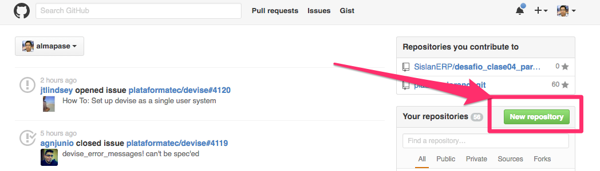
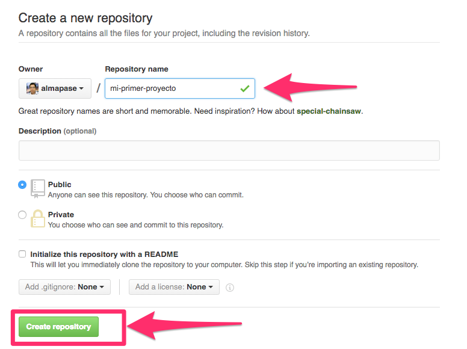
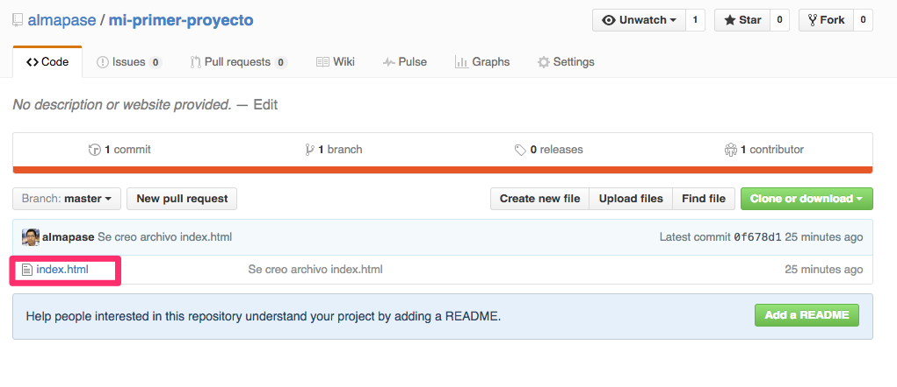

# Creando nuestro primer proyecto con Git y GitHub

--------------------------------------------------------------------------------

Ya tenemos todo preparado para crear nuestro primer proyecto con Git y conectado con GitHub, hay formas de hacerlo podemos iniciar primero en GitHub o podemos hacerlo primero en nuestro equipo con Git. En este post comenzaremos en nuestro equipo, para lo cual abriremos nuestra terminal y crearemos una carpeta donde guardaremos nuestro proyecto.

```
~ mkdir primer-proyecto-git
~ cd primer-proyecto-git
~/primer-proyecto-git
```

Ya estamos ubicados en nuestra carpeta lo primero que hacemos es inicializar Git para que comience a traquear los cambios.

```
~/primer-proyecto-git git init
Initialized empty Git repository in /Users/almapase/primer-proyecto-git/.git/
~/primer-proyecto-git
```

Inicializado nuestro repositorio, creamos un archivo con algo de texto y hacemos el commit correspondiente para que el repositorio quede actualizado.

```
~/primer-proyecto-git echo "<h1>Hola Mundo desde Git hacia GitHub" >> index.html
~/primer-proyecto-git git add index.html
~/primer-proyecto-git git commit -m "Se creo archivo index.html"
[master (root-commit) 0f678d1] Se creo archivo index.html
 1 file changed, 1 insertion(+)
 create mode 100644 index.html
~/primer-proyecto-git
```

Ahora no dirigimos a [GitHub](https://github.com/) y damos click en *New Repository*.



Le damos un nombre a nuestro proyecto, no es obligación que sea el mismo de nuestro repositorio local, con el nombre ingresado damos click en *Create Repository*.



Estamos a un paso de completar nuestro objetivo, nos resta seguir las instrucciones que GitHub nos ofrece en pantalla, en nuestro caso usaremos la opción que dice: *…or push an existing repository from the command line*


```
~/primer-proyecto-git git remote add origin git@github.com:almapase/mi-primer-proyecto.git
~/primer-proyecto-git git push -u origin master
Counting objects: 3, done.
Writing objects: 100% (3/3), 267 bytes | 0 bytes/s, done.
Total 3 (delta 0), reused 0 (delta 0)
To git@github.com:almapase/mi-primer-proyecto.git
 * [new branch]      master -> master
Branch master set up to track remote branch master from origin.
~/primer-proyecto-git
```

Con esto hemos completado nuestro objetivo de configurar Git con GitHub.


