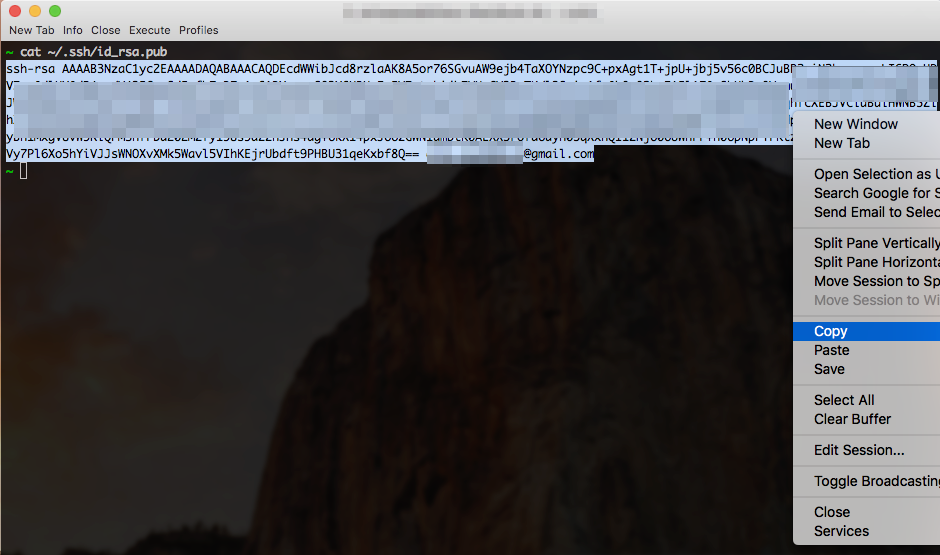
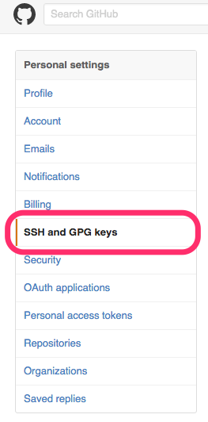
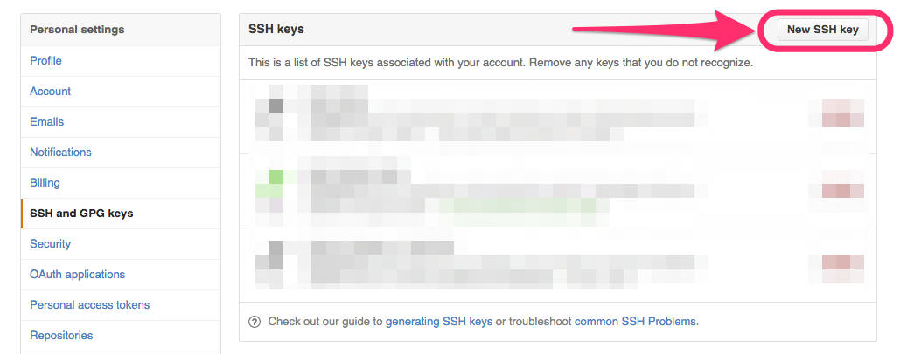
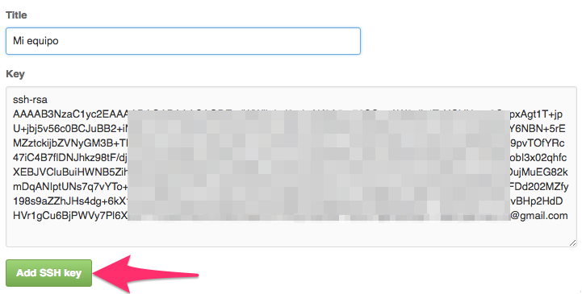

# Instalación y Configurando Git y GitHub en Mac y Linux

--------------------------------------------------------------------------------

## Git

Git en un software de control de versiones que fue diseñado por Linus Torvalds, desde sus inicios fue pensado para que operara cono un software de bajo nivel y que otros se encargaran de crear la interfaz grafica o front-end. pero hoy en día Git es un software de control de versiones con funcionalidad plena, 100% en la terminal. Si bien es cierto que hoy en día existen varios software con interfaz gráfica, que nos permiten operar con Git, aquí lista de Guis para Git, en este post nos concentraremos en la instalación y configuración de Git desde la terminal tanto en Linux como en OSX. 


### Instalando Git en Linux

La instalación de Git en Linux es extremadamente fácil, dependiendo de la versión de Linux que estés usando va a cambiar el gestor de paquetes que necesitemos usar, pero antes de instalar primero verifiquemos si es que ya esta instalado, para la cual abrimos nuestra terminal y ejecutamos el siguiente comando:

```
~ git --version
```

Si obtenemos como respuesta: `git version X.X.X` significa que ya lo tenemos instalado, pero si obtenemos algo como `git command not found` procedemos con la instalación.

- Debian/Ubuntu
    
    ```
    ~ apt-get install git
    ```

- Fedora
    
    ```
    ~ yum install git (up to Fedora 21)
    ~ dnf install git (Fedora 22 and later)
    ```

-  Gentoo
    
    ```
    ~ emerge --ask --verbose dev-vcs/git
    ```

- Arch Linux
    ```
    ~ pacman -S git
    ```

- openSUSE
    ```
    ~ zypper install git
    ```

- FreeBSD
    ```
    ~ cd /usr/ports/devel/git`
    ~ make install`
    ```

- Solaris 11 Express
    
    ```
    ~ pkg install developer/versioning/git
    ```

- OpenBSD

    ```
    ~ pkg_add git
    ```


### Instalando Git en OSX

Para instalar Git en OSX lo mejor es dirigirnos al siguiente enlace [Download for macOS](https://git-scm.com/download/mac), se descargará un paquete el cual instalamos como cualquier aplicación en Mac, Para comprobar que la instalación quedo correcta, abrimos nuestra terminal y ejecutamos el comando que se muestra a continuación y debemos tener como respuesta la versión de Git que instalamos.

```
~ git --version
git version 2.8.1 (Apple Git-66)
```


### Configurando Git

Las instrucciones para configurar Git son las mismas para Linux y para OSX, lo que debemos configurar en Git en nuestro nombre y nuestro email, pero el email es importante que sea uno valido pues será el mismo que usaremos para registrarnos en GitHub mas adelante en este post.

- Para configurar nuestro nombre ejecutamos el siguiente comando en la terminal.
    
    ```
    ~ git config --global user.name "Tu Nombre"
    ```

- Para configurar nuestro email
    
    ```
    ~ git config --global user.email "correo@dominio.com"
    ```

Ahora estamos listos para usar Git de forma local, pero la verdadera potencia de Git es que permite el trabajo colaborativo en forma distribuida y el complemento perfecto para poder llevar a cabo estas tareas es GitHub.


## GitHub

GitHub es una plataforma web que permite administrar proyectos usando el control de versiones Git, facilitando el desarrollo colaborativo de software.


### Creando nuestra cuenta en GitHub

Para crear nuestra cuenta ingresamos a la siguiente url: [GitHub](https://github.com/) y completamos los datos del registro recuerda que debes usar el mismo correo que usaste para configurar Git en tu equipo. 


### Conectando nuestro equipo con GitHub por medio de SSH

Una vez completado nuestro registro en GitHub, debemos indicarle a GitHub de que equipo o equipos nos comunicaremos con el, esta comunicación la haremos por medio de SSH (Secure Shell), para esto debemos crear un par de llaves SSH una publica y otra privada. Esto es algo que asusta a algunos desarrolladores que recién comienzan en esto de Git y GitHub. Comencemos con la creación de las llaves, para esto vamos a nuestra terminal y revisamos que exista la carpeta `.sshdentro` del $HOME

```
~ ls -a | grep .ssh
```

Si obtuvimos como respuesta `.ssh` significa que ya tenemos la carpeta, si no tenemos ningún resultado, debemos crear la carpeta con el siguiente comando:

```
~ mkdir .ssh
# si consulatamos ahora por la carpeta
~ ls -a | grep .ssh
.ssh # <-- ahora obtenemos la respuesta correcta
```

Con nuestra carpeta `.ssh` lista, crearemos nuestras llave publica y privada, en nuestra terminal ejecutamos el siguiente comando:

```
~ ssh-keygen -t rsa -b 4096 -C "correo@domino.com"
# Crea una nueva clave ssh, utilizando el correo electrónico proporcionado como etiqueta
Generating public/private rsa key pair.
```

Cuando aparezca en el Prompt *"Enter a file in which to save the key,"* presiona Enter ↲. Así aceptaras la ubicación por defecto.

```
Enter a file in which to save the key (/Users/you/.ssh/id_rsa): [Press enter] ↲
```

Luego el Prompt te pedirá ingresar una password, las dejaremos en blanco, así que solo presiona Enter ↲ y terminaremos.

```
Enter passphrase (empty for no passphrase): [Type a passphrase] ↲
Enter same passphrase again: [Type passphrase again] ↲
```

Con estos pasos ya hemos creado nuestro par de llaves, lo podemos verificar, revisando el contenido de la carpeta `.ssh`, debemos encontrar ahí dos archivos uno llamado `id_rsa` y otro llamado `id_rsa.pub`, este último archivo es la llave pública y es la que compartiremos. El archivo sin el `.pub` es la llave privada y **no se debe compartir con nadie**. Ahora agregaremos nuestra llave ssh al ssh-agent. Nos aseguramos que el agente esta habilitado:

```
# iniciar el ssh-agent en segundo plano
~ eval "$(ssh-agent -s)"
Agent pid 59566
```

Con el agente habilitado, agregamos nuestra llave privada al ssh-agent:

```
~ ssh-add ~/.ssh/id_rsa
```

Ahora estamos listos para nuestro último paso, agregar nuestra llave publica en nuestro perfil de GitHub. Antes de ir a nuestro perfil copiaremos la llave publica de la siguiente forma:

```
~ cat ~/.ssh/id_rsa.pub
```

Obtendremos el siguiente resultado, el cual copiaremos, teniendo cuidado de no incluir ningún espacio en blanco al principio o al final.

```
ssh-rsa AAAAB3NzaC1yc2EAAAADAQ7flDNJhkz98tF/djabnPKkCtjMyBu/Q/WDnkgI1Qs1piLakU26/AlfRk+BkSuSeRtQ2Yl9Jyb5jPrTU2S8bobI3x02qhfcXEBJVCluBuiHWNB5ZihXf3COEnRIHyNR7axWqbByyuPIK5mQI5JhHYZZLVe/YSr1sGcwtNW7nXnAxuz/IOujMuEG82kmDqANIptUNs7q7vYTo+9KTaGBMLFG3YtozlQrUdpzSYMxgGjdH5AlJR+FHpEyBvW9RlQPMSnfFDd202M4pxJ66zGwN1qmbtK0ALXX5rOfd6uyh05qXxhQI1ZNj606UwhFF+h06pNpPYFKtzvBHp2HdDHVr1gCu6BjPWVy7Pl6Xo5hYiVJJsWNOXvXMk5Wavl5VIhKEjrUbdft9PHBU31qeKxbf8Q== correo@dominio.com
~
# PD: está no es una llave real, es solo para ejemplificar.
```



Con nuestra llave pública en el porta papeles no dirigimos a: [Profifle](https://github.com/settings/profile) o podemos hacer click en nuestra foto de perfil ubicada en el extremo superior derecho y seleccionar la opción *settings*


Ahora seleccionamos la opción *SSH and GPG keys*



Hacemos click en *New SHH key*



Llego el momento de pegar nuestra llave publica, lo hacemos según la imagen de abajo, en el campo *Title* usar un nombre descriptivo del equipo en el que generaron la llave. damos click en *Add SSH key*.



Si el resultado fue exitoso obtendrán un resultado parecido al siguiente


--------------------------------------------------------------------------------

|                 ⇦           |        ⌂     |                  ⇨            |
|:----------------------------|:------------:|------------------------------:|
| [Página anterior][anterior] | [Menu](menu) | [Página siguiente][siguiente] |


[anterior]: ../README.md
[menu]: ../README.md
[siguiente]: ./First_Proyect.md
